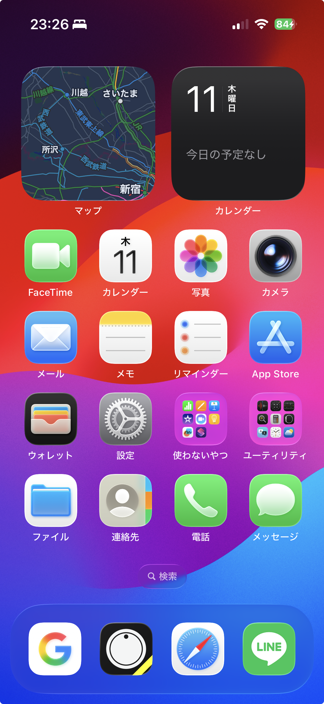

+++
date = '2025-12-11T23:27:26+09:00'
lastmod = '2025-12-11T23:27:26+09:00'
draft = false
tags = []
category = "日記"
subcategory = ""
title = 'iOS26はリキッドグラスデザイン'
+++

iPhoneをアプデしたらデザインが大幅に変わってました。

前のiOS18はフラットなデザインでしたが、打って変わってスキューモーフィズム（初期のiPhoneのUI）っぽい、写実的な要素を取り入れた感じになりました。懐かしいようで新しい質感です。

カメラのアイコンが記号じゃなくて写実的なレンズなところに、ものすごく懐かしさを覚えます。

同じグラス系のデザインでも、磨りガラスのようなグラスモーフィズムと違って、水滴のようなクリアな透け感なところが面白いなと思いました。

