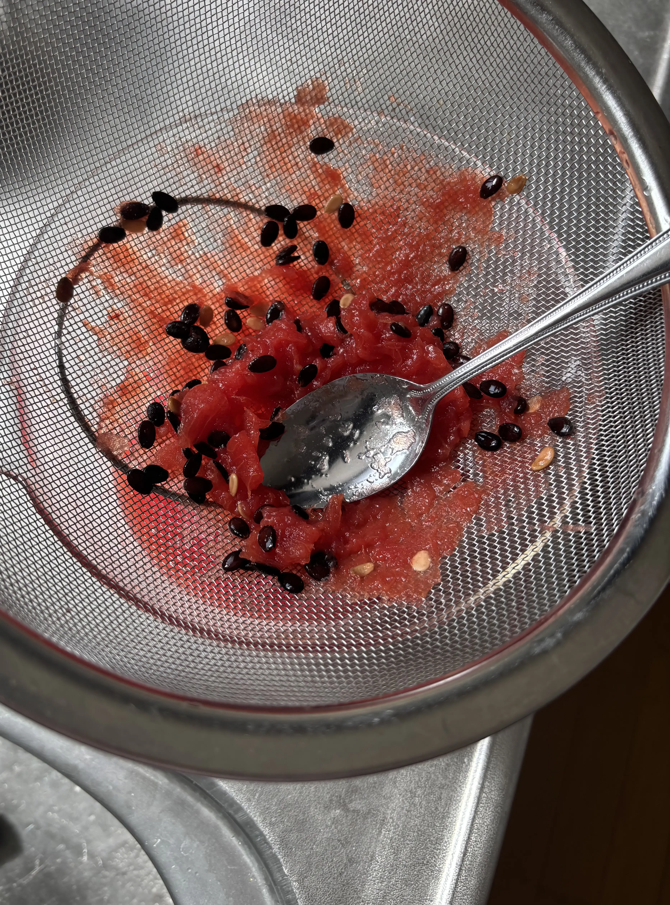
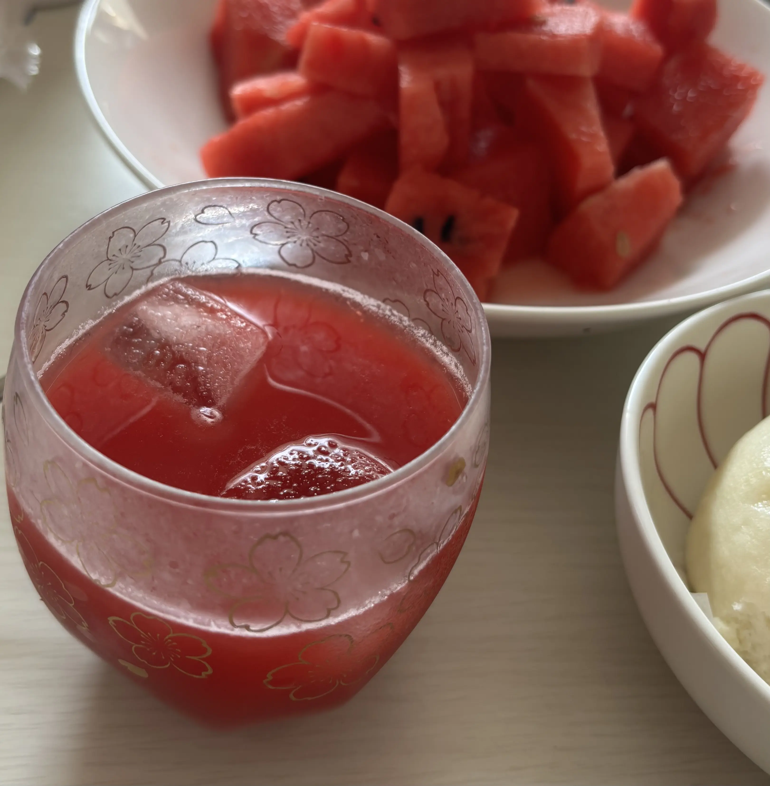

+++
date = '2025-08-29T21:39:06+09:00'
lastmod = '2025-08-29T21:39:06+09:00'
draft = false
tags = []
category = "ライフハック"
subcategory = ""
title = 'ざらざらになったスイカを美味しいスイカジュースにする'
+++

スイカは熟しすぎると水分が抜けて果肉がモサモサとした食感になって美味しくないですが、ジュースにしてみたところとても美味しく食べることができたので、作り方を記録しておきます。

## 作り方

ザルにスイカを入れて、ザルの下にコップをセットします。スプーンで潰すようにしてこすと簡単にジュースになります。

ジューサーなどを使わなくても簡単にできました。しっかり熟しているので果汁はとても甘味があります。少しつぶつぶ感がありますが嫌な食感ではなく、搾りたてという感じで美味しかったです！

ちなみに私の実家は庭にスイカを植えると人が死ぬと言われていて、スイカ栽培が禁忌になっています。（いつ頃から言われ始めたかは不明）

