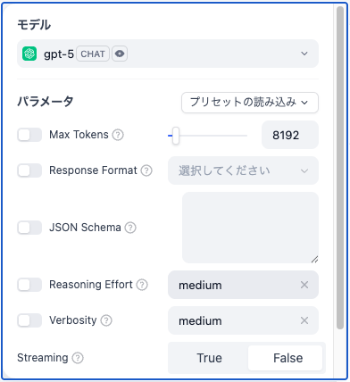

+++
date = '2025-09-17T11:53:14+09:00'
lastmod = '2025-09-17T11:53:14+09:00'
draft = false
tags = ["OpenAI", "GPT5"]
category = "Debug"
subcategory = ""
title = 'GPT5を使う際のエラー "Your organization must be verified to stream this model."'
+++

> [models] Bad Request Error, Error code: 400 - {'error': {'message': 'Your organization must be verified to stream this model. Please go to: https://platform.openai.com/settings/organization/general and click on Verify Organization. If you just verified, it can take up to 15 minutes for access to propagate.', 'type': 'invalid_request_error', 'param': 'stream', 'code': 'unsupported_value'}}

DifyでGPT5を使用しようとした際、上記のエラーが発生しました。

どうやら、GPT5のストリーミング機能を使用するには制限があり、組織の認証が必要なようです。リンク先を確認したところPersonaというサービス経由での認証を求められました。

ChatGPTのストリーミング機能は、APIレスポンスをトークン単位で逐次的に返す仕組みです。回答が全文出力されるまで待つ必要がなく、文字がタイピングされるようになめらかに回答を受け取れる機能です。

## 解決策1: 認証を行う

エラーメッセージに従ってPersonaでの組織認証を完了すれば、GPT5のストリーミング機能が利用可能になります。

https://community.openai.com/t/why-can-non-verified-organisations-use-gpt-5-and-gpt-5-mini-but-not-stream-them/1338294/1

ですがちょっと調べた感じだと、個人情報を入力する必要があるかつ外部の機関が運営しているので、登録を懸念する声が多いみたいですね…

社内利用とかでしたら尚更、代表の方のマイナンバーカードを提出する必要があるのはハードルが高いです。

## 解決策2: Streamingを使用しない

Difyの設定画面からは、StreamingをFalseにして使うことができました。（画像最下部）

APIを使用している場合もパラメータを変更すれば使えるでしょう。

クライアント側でリアルタイムレスポンスが不要であればこの対応で十分だと思います。
例えば、Difyをバックエンドサービスとして外部APIから呼び出してるならStreamingにしたところ
で意味ないですし、バッチ処理や定期実行のワークフローでは完全なレスポンスを一括で受け取る方
が適していると思いました。

## 解決策3: モデル変更

モデルを4oに変えたところエラーなく使えたので、このストリーミング機能の制限はGPT5系のみの制限のようです。

どうしてもストリーミング機能を使いたい、かつ認証は行いたくない、という場合は、ダウングレードになりますが4oへモデルを変更するのも手だと思いました。
